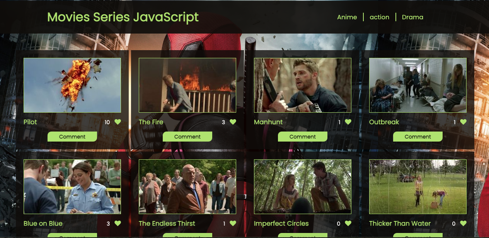

# JavaScript-group-capstone
This is JavaScript Module capstone project, and this project is about building a web application based on an external API. we have selected an API that provides data and another wich adds the comments and likes about movie series and then built the webapp around it. 

## Built With

• HTML, CSS 
• JavaScript
• VSCode
• Webpack
. ES6
. API Services

## Demo Video
[Demonstration Video](https://drive.google.com/drive/folders/1wtzX7u8tSCPgpJryMD9TiMrA8NoiLf1s?usp=sharing)

## Movie screen shot

## Page Link 
[live link](https://tuyishimireeric.github.io/JavaScript-group-capstone/dist/)
Clone and run NPM install locally then NPM run start
http://localhost:8080/

## Getting Started
To get a local copy of this exercice, Please follow these simple example steps.

1. Clone this repository or download the Zip folder:

**``git@github.com:TuyishimireEric/JavaScript-group-capstone.git``**

2. Navigate to the location of the folder in your machine:

**``you@your-Pc-name:~$ cd <folder>``**

3. Press Enter to navigate to your local clone.

Now you can go and play with it as you wish :smile:

## Authors
👤 Mark Otuya

• GitHub: @markotuya0

• Twitter: @mark__anthonny

👤 Eric TuyishimireEric

. Github: @TuyishimireEric

## Show your support
Give a ⭐️ if you like this project!

## Acknowledgments

- Hat tip to anyone whose code was used
- Big thanks to the [Microverse](https://bit.ly/MicroverseTN) community with a special mention of my coding partners, morning session teams, standup teams and reviewers.

## 📝 License
This project is [MIT](./LICENSE.txt) licensed.
